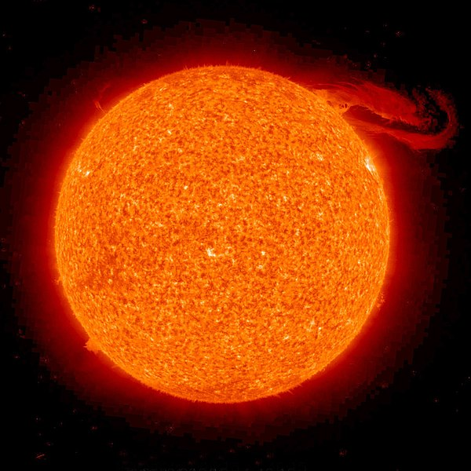

# Soleil
Soleil est l’étoile du Système solaire.

Image trouvée sur [Wikipedia](https://commons.wikimedia.org/wiki/File:Solar_prominence_from_STEREO_spacecraft_September_29,_2008.jpg?uselang=fr).

## Caractéristiques

- Masse : 1,9891 × 1030 kg
- Diamètre : 1 392 684 km

## Temperature

Vraiment très chaud, attention de ne pas trop s'approcher
