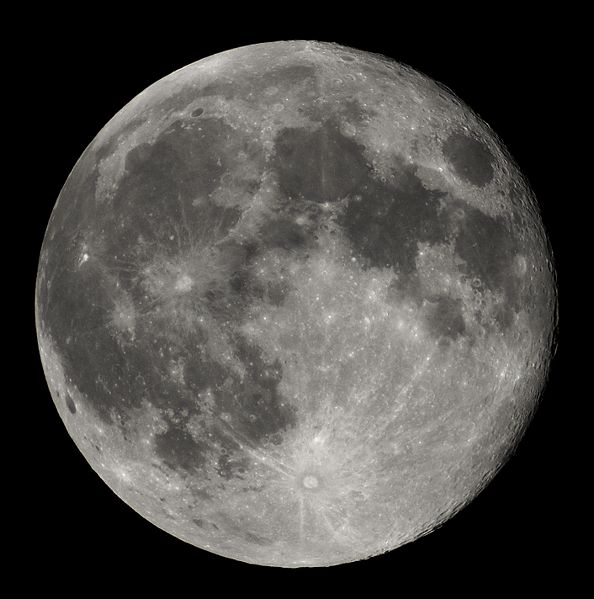

# Lune

Lune est satellite de la Terre.

Icone trouvée sur [Wikipedia](https://fr.vikidia.org/wiki/Fichier:Full_Moon_Luc_Viatour.jpg).

## Caractéristiques

- Masse : beaucoup de kg
- Diamètre : je sais pas km

